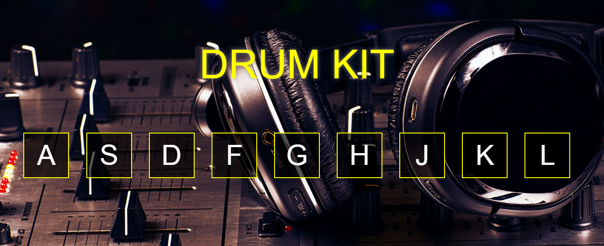

# Drum Kit

O objetivo deste projeto é que a cada tecla pressionada um som de bateria correspondente seja reproduzido. Ele também tem animações CSS para tornar o projeto mais interativo para o usuário. 

  

## Funcionalidades do JavaScript utilizadas

- Manipulação do DOM
- Estrutura de Controle e Objeto
- API de áudio HTML
- Manipulação do CSS pelo JavaScript
- addEventListener
